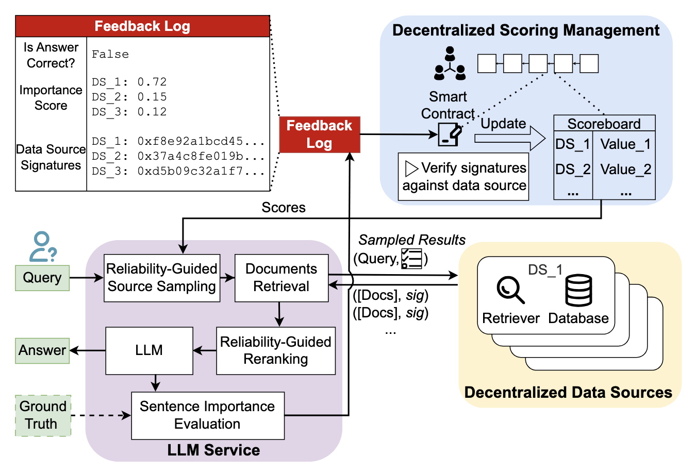

# A Decentralized Retrieval Augmented Generation System with Source Reliabilities Secured on Blockchain

<!-- <p align="center">
  
  
  
</p>

<p align="center">
  <b>We built drag, a decentralized RAG system that addresses data reliability challenges in real-world settings </b><br>
  <a href=""><b>Paper on arXiv</b></a>
</p> -->

<p align="center">
  <b>TL;DR: We built dRAG, a decentralized RAG system that addresses data reliability challenges in real-world settings </b><br>
</p>

---

## ⚙️ System Overview
Our dRAG system can be abstracted into three components: *Decentralized Data Sources*, *LLM Service*, and *Decentralized Blockchain Network*. Details can be found in Section 5 of the paper.

<p align="center">
  
</p>

## 🚀 How to Deploy dRAG?
We provide detailed instructions for starting the [retrieval service](drag_data_source/README.md), [LLM service](drag_llm_service/README.md), and interacting with the [smart contract](drag_python_client/README.md). For your convenience, we also provide a one-line command to launch the entire dRAG system.

### Quick Start (One-Line Command)
To start all services using Docker Compose:

```bash
docker compose up -d
```

This will:
1. Start the contract service (a smart contract deployed on local Hardhat node for testing)
2. Start all three data sources simultaneously (data-source-0, data-source-20, data-source-100, each is assigned with a testing private key provided by Hardhat)
3. Start the LLM service after all data sources are healthy. The LLM service will also have a private key.

To view logs:
```bash
docker compose logs -f
```

To stop all services:
```bash
docker compose down
```

### Testing the System
Once all Docker containers are up and running, you can use the `test.ipynb` Jupyter notebook to interact with the system. The notebook contains:
- Health check tests for all services
- Example queries to test the RAG system
- Integration tests to verify the end-to-end functionality
or check Reliable-dRAG-anonymous/drag_llm_service/README.md for endpoint description.

To use the notebook:
```bash
jupyter notebook test.ipynb
```

Make sure all services are healthy before running the tests. You can check the service status with:
```bash
docker compose ps
```

If you wish to test the system with publicly smart contract, there is an example deployment on Sepolia (a public Ethereum testnet) at [0x5F67901BC1A22010BA438EDa426A70d0B5eA17Be](https://sepolia.etherscan.io/address/0x5F67901BC1A22010BA438EDa426A70d0B5eA17Be). A private key of Sepolia wallet and Infura api key are needed to connect to the testnet.

### Example Visualization
The dRAG system provides real-time monitoring of source scores (usefulness and reliability) over queries.

<p align="center">
  
</p>

The visualization demonstrates how the system learns and adapts to source quality over time, with sources showing different performance characteristics based on their pollution levels and content quality.

## 📖 Folder Structure
```
data/                 // Synthetic polluted datasets for experiments
drag_contract/        // Hardhat project + Solidity DragScores contract
drag_data_source/     // Dockerized retrieval service
drag_llm_service/     // Dockerized LLM orchestrator service
drag_python_client/   // Minimal Python client for DragScores
result/               // Result example for live visualization
```

<!-- ## 📚 Citation
If you use our code or system, please cite the following paper:
```

``` -->